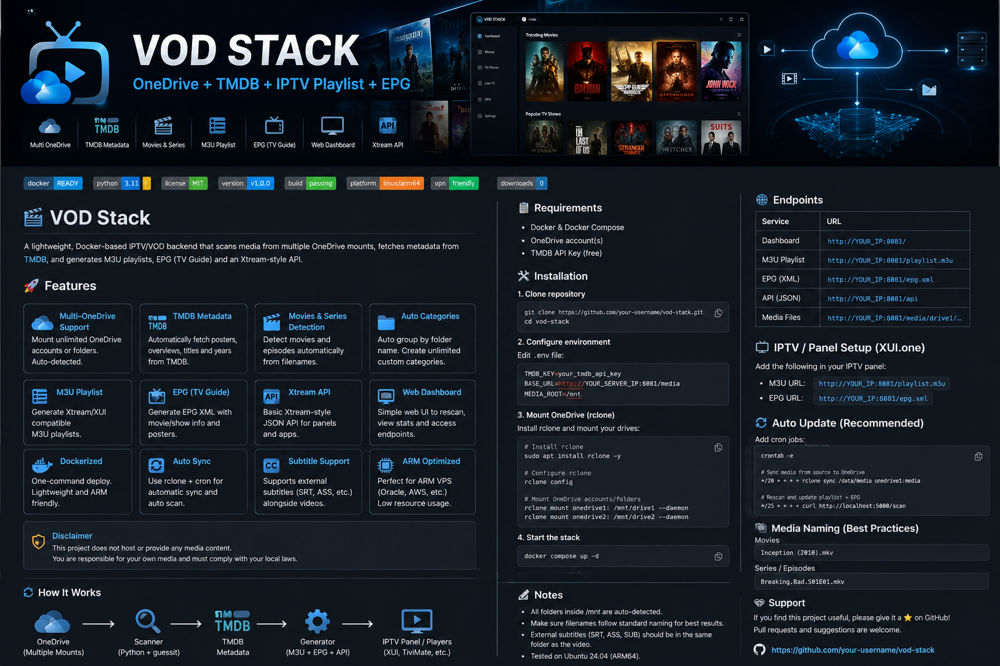

<p align="center">
  
</p>

<h1 align="center">🎬 VOD Stack</h1>
<p align="center">
  OneDrive + TMDB + IPTV Playlist + EPG
</p>

<p align="center">
  
  
  
</p>

<p align="center">
  
  
</p>

<p align="center">
  
  
</p>

<p align="center">
  
  
  
  
</p>

<p align="center">
  
</p>

---

## 🚀 Overview

A lightweight, Docker-based IPTV/VOD backend that:

- 📁 Scans media from multiple OneDrive mounts  
- 🎬 Fetches metadata from TMDB  
- 🧠 Auto-detects Movies & Series  
- 📺 Generates M3U playlist (Xtream/XUI compatible)  
- 📡 Generates EPG (XML TV guide)  
- 🌐 Provides API + Web dashboard  

---

## ✨ Features

- ✅ Multi–OneDrive support (auto-detected)  
- ✅ TMDB metadata (poster, overview, titles)  
- ✅ Movies + Series detection  
- ✅ Auto categories (by folder)  
- ✅ M3U playlist generation  
- ✅ EPG XML generation  
- ✅ Xtream-style JSON API  
- ✅ Web dashboard  
- ✅ ARM-friendly (Oracle VPS optimized)  

---


## ⚙️ Setup

### 1. Clone

```bash
git clone https://github.com/oVo-HxBots/vod-stack.git
cd vod-stack
```
### **2. Configure .env**
```
TMDB_KEY=your_tmdb_api_key
BASE_URL=http://YOUR_SERVER_IP:8081/media
MEDIA_ROOT=/mnt
```
### 3. Mount OneDrive (rclone)
```bash
sudo apt install rclone -y
rclone config
rclone mount onedrive1: /mnt/drive1 --daemon
rclone mount onedrive2: /mnt/drive2 --daemon
```
### 4. Start
```bash
docker compose up -d
```

## 🌐 Endpoints
```
Service         URL             
Dashboard  http://YOUR_IP:8081

Playlist   http://YOUR_IP:8081/playlist.m3u

EPG        http://YOUR_IP:8081/epg.xml

API        http://YOUR_IP:8081/api
```

## 📺 IPTV Setup

 #### Works with panels like XUI.one

#### M3U: http://YOUR_IP:8081/playlist.m3u
#### EPG: http://YOUR_IP:8081/epg.xml


## 🔄 Auto Update
```bash
crontab -e

*/20 * * * * rclone sync /data/media onedrive1:media
*/25 * * * * curl http://localhost:5000/scan
```
## 🧠 How It Works
```sh
 OneDrive → /mnt
        ↓
 Scanner (Python + guessit)
        ↓
 TMDB metadata
        ↓
 M3U + EPG + API
        ↓
 IPTV Panel / Player
```

## 📂 Naming (Important)

#### Movies
Inception (2010).mkv

#### Series
Breaking.Bad.S01E01.mkv

## ⚠️ Disclaimer
 - This project does NOT provide content
 - You are responsible for your usage
 - Ensure compliance with local laws

## 🔥 Roadmap
 - 🔐 Xtream login system
 - 🎬 Netflix-style UI
 - 📡 Live TV + real EPG
 - ⚡ HLS streaming

## ⭐ Support
 - If you like this project, give it a ⭐ on GitHub!
